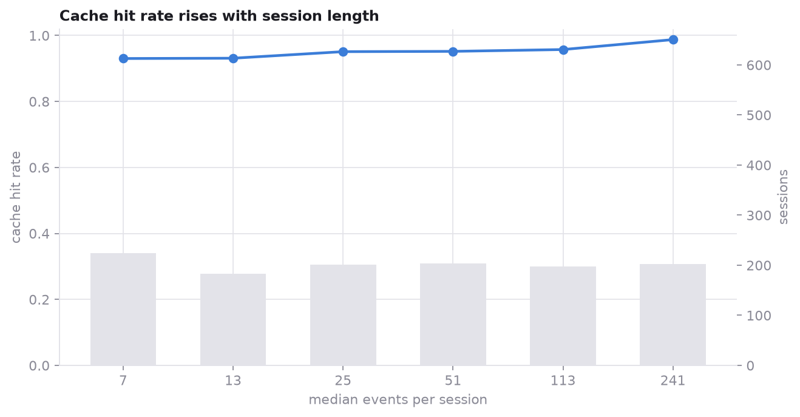
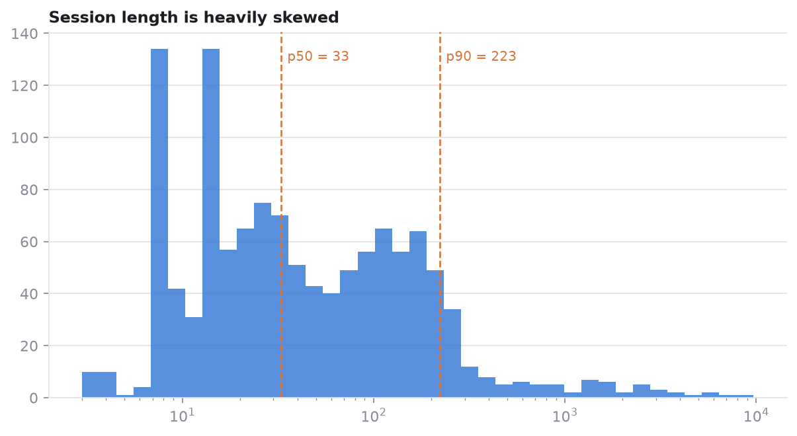

# agent-telemetry

[](https://github.com/AlexDesign420/agent-telemetry/actions/workflows/ci.yml)
[](LICENSE)
[](data/LICENSE)

Claude Code writes a detailed log of every session to `~/.claude/projects/`. Nobody
reads it, because it holds prompt text, file paths and whatever a tool happened to
print. This extracts the metrics and leaves the content behind.

Included: the pipeline, and an anonymized dataset of **1,213 sessions and 181,406
events** produced by running it on one person's logs, plus the analysis of it.

## The privacy design

The pipeline is built so that content cannot reach the output by accident:

1. **A field allowlist, not a blocklist.** The extractor reads a fixed list of
   fields. A blocklist protects against the fields you thought of; when the log
   format grows a new one, it flows straight through. An allowlist fails the other
   way — an unknown field is counted, reported and ignored. The last extraction
   reported 15 fields the allowlist does not know, including `aiTitle`, which
   holds a generated summary of the conversation.
2. **Keyed hashes for identifiers.** Session ids, working directories and branch
   names become `project-1f4c8a2b` style labels. The key is local and gitignored,
   so the labels are stable for you and meaningless to anyone else.
3. **k-anonymity at k=5.** Any category occurring fewer than five times is folded
   into `other`, so a rare client version or a tool used once cannot single out a
   session.
4. **An independent scan that stops the pipeline.** Regex checks for API keys,
   tokens, private keys, email addresses, absolute paths, URLs and long free text.
   A finding raises rather than filtering: silently dropping a leaked value would
   hide the fact that the allowlist has a hole.

The scan runs **twice**, before and after k-anonymity. This is not redundancy: a
value leaking once would otherwise be folded into `other` and never seen, while
the same value leaking six times would be caught. The guarantee cannot depend on
how often a mistake was repeated. A test asserts both cases.

## Findings

All of these are reproducible from `data/*.parquet` — see
[notebooks/05-findings.ipynb](notebooks/05-findings.ipynb).

**The prompt cache carries 98.2 percent of the input side.** Output tokens are
0.26 percent of all tokens. Everything about cost in an agent session is decided
on the input side, and almost all of the input side is cache reads.

**The cache pays off immediately, not eventually.** The shortest fifth of sessions
— a median of 7 events — already reaches a 93 percent hit rate; by 241 events it
is 99 percent. The practical consequence runs against intuition: restarting a
session to keep the context small throws away the cache and can cost more than
continuing a long one.



**Two tools are 84 percent of all calls.** Bash is 51 percent, Read is 33 percent.
The most common tool sequences are self transitions — Bash after Bash — which is
what batched exploration looks like from the outside.

**Tool failures are rare and concentrated.** 2.6 percent of tool results come back
as errors, and 753 of 1,117 sessions have none at all.

**Most session files are subagents, which is easy to misread.** 84 percent of the
log files are subagent runs, because a subagent gets its own file. Of the 196 main
sessions, 15 percent spawned an agent — and those sessions had a median of 1,286
events against 38 for the rest.

**The mean session describes no session.** Median 33 events, p99 2,536. Every
figure in this repository uses medians for that reason.



## Use it on your own logs

Not on PyPI yet; install from the repository:

```bash
git clone https://github.com/AlexDesign420/agent-telemetry
cd agent-telemetry
pip install -e ".[viz]"

agent-telemetry extract                      # reads ~/.claude/projects by default
agent-telemetry scan data/sessions.parquet   # verify before sharing anything
agent-telemetry summary
agent-telemetry figures
```

`extract` prints what it read, what k-anonymity suppressed, and every log field
the allowlist does not recognize. Read that last list before publishing an
extract of your own.

Your labels will not match the ones in `data/`: the salt is per machine.

## The dataset

| File | Rows | Grain |
| --- | --- | --- |
| `data/sessions.parquet` | 1,213 | one session |
| `data/events.parquet` | 181,406 | one line of a session log |

[data/DATA_CARD.md](data/DATA_CARD.md) documents every column, and specifically
the four that are easy to misread: `duration_minutes` measures elapsed wall clock
time and not effort, `total_tokens` re-counts the context on every turn,
`is_sidechain` is a property of the session and not of an event, and
`primary_model` is blank for sessions that never reached a model.

## Notebooks

1. [Data quality](notebooks/01-data-quality.ipynb) — coverage, blanks, schema drift, and which columns lie
2. [Token economics](notebooks/02-token-economics.ipynb) — where the tokens go and what the cache is worth
3. [Tool usage](notebooks/03-tool-usage.ipynb) — frequency, failure rates, sequences
4. [Model comparison](notebooks/04-model-comparison.ipynb) — and why this data cannot rank models
5. [Findings](notebooks/05-findings.ipynb) — the numbers quoted above

## What this dataset cannot tell you

- **Whether any model is better.** Models were chosen per task, not assigned at
  random, so every difference between them is confounded with what they were
  chosen for. Notebook 4 does what can be done honestly and says where it stops.
- **Whether the agent succeeded.** Nothing in the logs records the outcome of a
  task. No success rate exists in this data, and any that appears to has been
  invented.
- **How long work took.** `duration_minutes` includes the hours a terminal window
  sat open.
- **Anything general.** One user, one machine, two months, one working style. It
  describes that. The pipeline runs on anyone's logs, and the comparison between
  two datasets is the part that would be worth something.

## Development

```bash
uv venv && uv pip install -e ".[dev]"
pytest
ruff check . && ruff format --check .
mypy
```

The privacy tests are the ones that matter: every scan rule has a test that fires
it, the extractor is asserted never to emit the fixture's prompt text, and a
deliberately reintroduced leak is asserted to stop the write.

## License

Code MIT, dataset [CC BY 4.0](data/LICENSE).
